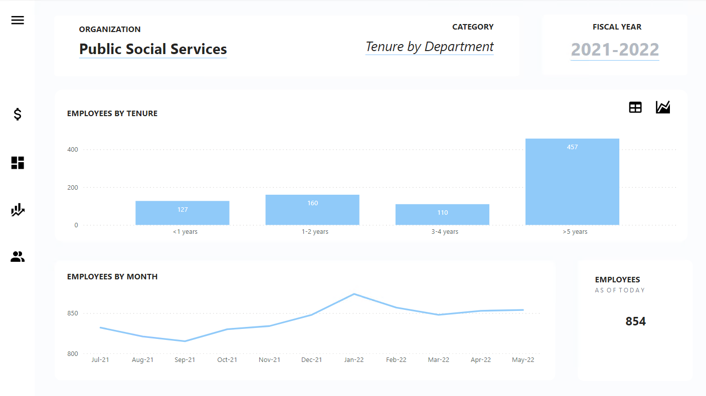
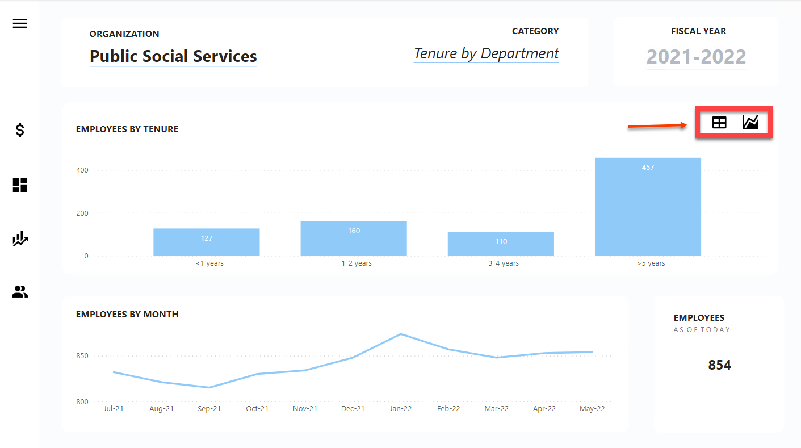
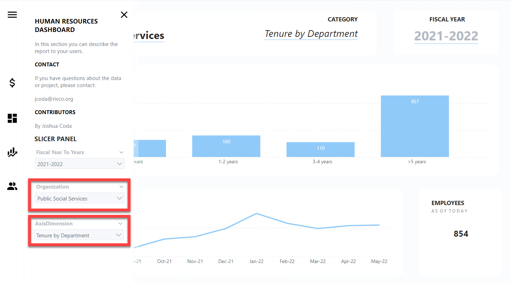
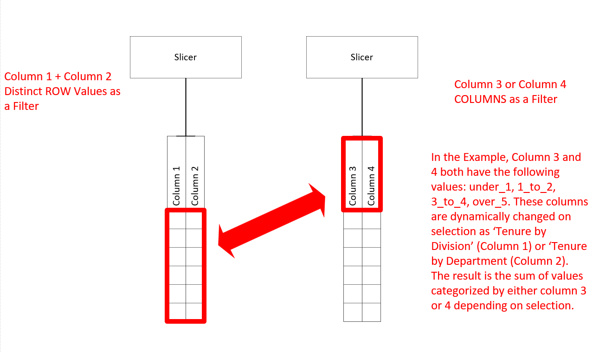
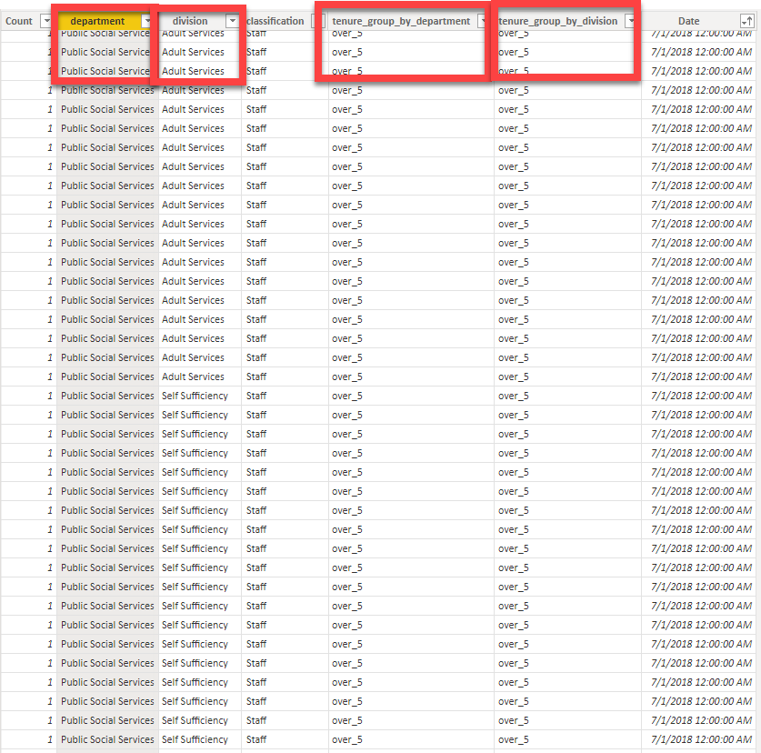

# Power BI Dynamic Table Example

The data provided in this example is placeholder data and does not reflect any real information. 

This project is an an example of a dynamic matrix slicer. The purpose of a dynamic table is to save visual space. Where you might normally neeed 2 graphs, 1 slicer can reduce the graph to 1. 

In the example, there are 2 slicers which do the following: 1) Slicer ROWs based data (i.e. Combined Division distinct values and Department distinct values into one slicer selection) and 2) Slicer COLUMN based data (i.e. Slices selected column data column 1: Tenure by Department; column 2: Tenure by Division). 

There are also additional useful feature examples such as a fiscal calendar, dynamic headers, and table/graph button bookmarks. 

A .pbix file is provided as an example. Please review the relationship tab, measures, and screenshots to better understand how to create dynamic tables.

## Screenshots

A table button and graph button, to change views. Hold Ctrl + left click when inside Power BI. These buttons are selected when published to a dashboard without using Ctrl. 

Slicer example are found in the upper left hamburger icon. Hold Ctrl + left click when inside Power BI. These buttons are selected when published to a dashboard without using Ctrl. 

Column 'department' and column 'division' are combined and slice data.
Column tenure_group_by_department slicer OR tenure_group_by_division slicer. What does this mean? The slicer 1 gives the following choices: (Public Social Services (department), Adult Services (division), Children Services(division), Self Sufficiency(division), Finance and Forecasting(division), Administrative Services(division),and Public Authority(division)). 
Slicer 2 gives the following choices: (tenure_group_by_department, tenure_group_by_division). These choices allow for a more robust analysis when understanding tenure, whether it is by department or division. This example can be applied to other scenarios where column data must be separated from row based data.

## Contact

If you have questions about the data or project, please contact:

jcoda@rivco.org

## Contributors

By Joshua Coda
